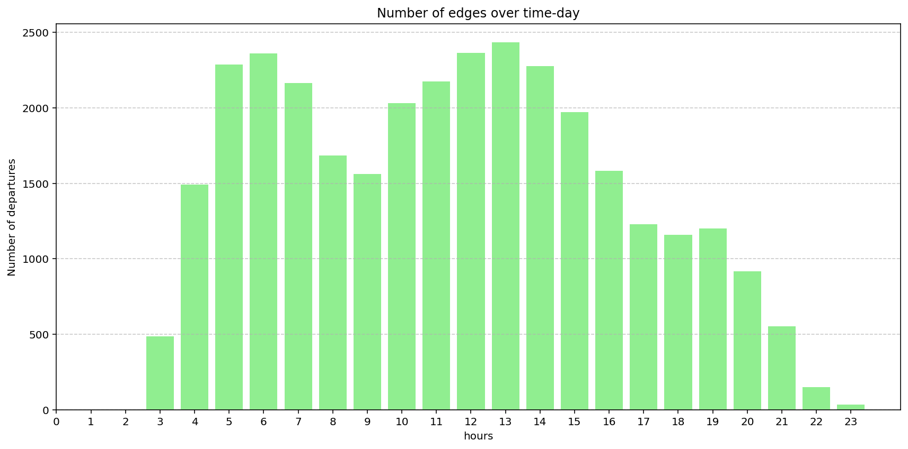
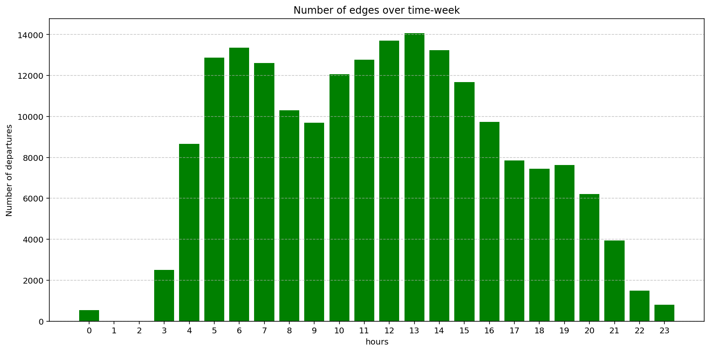

# Bus Transportation Network Analysis

This project analyzes daily and weekly bus transportation networks using Python and NetworkX. It constructs graphs from bus stops and routes, computes network metrics, and visualizes traffic patterns.

## Key Highlights

- **Longest Route**: Identified the bus route covering the maximum distance, along with its stops.  
- **Top-10 Most Frequent Stops**: Determined the busiest stops based on arrivals in daily and weekly networks.  
- **Largest Connected Component**: Extracted the largest undirected component to analyze the main network structure.  
- **Average Distance**: Approximated the average shortest-path distance between stops using random sampling and BFS.  
- **Closeness Centrality**: Computed approximate closeness for each stop, highlighting the top-10 most central stops.  
- **Traffic Patterns**: Visualized number of departures per hour for daily and weekly networks.

 ## Visualizations


 


## Usage

## Usage

1. **Place your CSV files** in the main project folder (same level as the Python script):

- `network_nodes.csv`  
- `network_temporal_day.csv`  
- `network_temporal_week.csv`  

> Make sure the filenames match exactly, or update the script accordingly.

2. **Install required Python packages**:

```bash
pip install pandas numpy networkx matplotlib
Optional: Verify files and working directory

Before running the script, you can check that Python sees the files correctly:

python
Copia codice
import os

print("Current working directory:", os.getcwd())
print("Files in this directory:", os.listdir())
This ensures the CSV files are in the correct folder.

Run the Python script:

bash
Copia codice
python Project_Python.py
Expected outputs:

Longest bus route and its stops

Top-10 most frequent stops for daily and weekly networks

Largest connected component and average shortest-path distance

Approximate closeness centrality for each stop (top-10 most central stops)

Bar plots showing departures per hour for day and week networks

Plot images saved in the images/ folder (daily_departures_kuopio.png and weekly_departures_kuopio.png)

yaml
Copia codice
